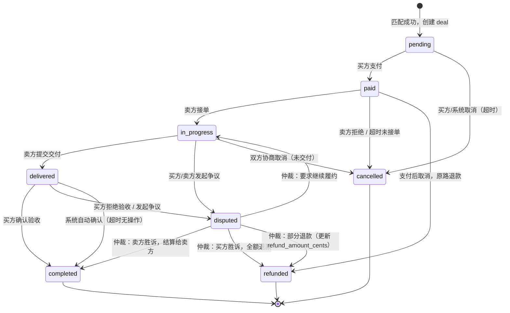

# Deal 状态机

> 状态字段对应 `deals.status`（VARCHAR(32)）。转移条件为契约定义，具体实现在 deals 模块会话中完成。

## 状态枚举

| status | 说明 |
|---|---|
| `pending` | 已创建，等待买方确认/支付 |
| `paid` | 买方已付款，资金已冻结至 escrow |
| `in_progress` | 卖方已接单，履约中 |
| `delivered` | 卖方已交付，等待买方验收 |
| `completed` | 买方验收通过，资金已结算 |
| `disputed` | 争议中，资金保持冻结 |
| `refunded` | 已全额或部分退款并关闭 |
| `cancelled` | 未进入履约即取消 |

## 状态转移图

## 转移条件详表

| 从 | 到 | 触发方 | 前置条件 | 副作用（契约层） |
|---|---|---|---|---|
| — | `pending` | 系统 | offer 与 intent 匹配成功 | 创建 deal 记录；关联 match_log |
| `pending` | `paid` | 买方 | 钱包余额 ≥ amount_cents | 冻结 buyer 钱包 `amount_cents`；写 wallet_ledger(entry_type=freeze) |
| `pending` | `cancelled` | 买方/系统 | 未支付 | 无资金操作 |
| `paid` | `in_progress` | 卖方 | — | — |
| `paid` | `cancelled` | 系统 | 卖方超时未接单 | 解冻并退回 buyer；ledger: unfreeze |
| `paid` | `refunded` | 买方/系统 | 支付后取消 | 全额退款；ledger: refund |
| `in_progress` | `delivered` | 卖方 | — | — |
| `in_progress` | `disputed` | 买方/卖方 | 填写 dispute_reason | 保持冻结状态 |
| `in_progress` | `cancelled` | 双方 | 协商一致，未交付 | 全额退款；ledger: refund |
| `delivered` | `completed` | 买方 | — | 解冻→扣款→卖方入账；ledger: payment |
| `delivered` | `disputed` | 买方 | 填写 dispute_reason | 保持冻结 |
| `delivered` | `completed` | 系统 | 验收超时（如 72h） | 同买方确认 |
| `disputed` | `completed` | 管理员 | 仲裁卖方胜诉 | 同 delivered→completed |
| `disputed` | `refunded` | 管理员 | 仲裁买方胜诉 | 全额退款；ledger: refund |
| `disputed` | `refunded` | 管理员 | 部分退款 | 更新 refund_amount_cents；ledger: refund |
| `disputed` | `in_progress` | 管理员 | 要求继续履约 | — |

## 终态

以下状态不可再转移（除审计修正外）：

- `completed`
- `refunded`
- `cancelled`

## 争议与退款字段

| 字段 | 表 | 说明 |
|---|---|---|
| `dispute_reason` | deals | 进入 `disputed` 时必填 |
| `refund_amount_cents` | deals | 部分退款时记录实际退款金额；全额退款时等于 `amount_cents` |
| `completed_at` | deals | 进入 `completed` / `refunded` / `cancelled` 时写入 |

## 并发与幂等

- 同一 deal 的状态转移 API 必须携带 `Idempotency-Key` 头（实现阶段），防止重复提交。
- 状态转移使用乐观锁：更新时校验 `updated_at` 或版本号，冲突返回 `40901`。
- 钱包操作与状态转移在同一数据库事务内完成。

## 预留 API（不在本阶段实现）

| 方法 | 路径 | 说明 |
|---|---|---|
| POST | `/api/v1/deals` | 创建 deal（pending） |
| POST | `/api/v1/deals/{id}/pay` | pending → paid |
| POST | `/api/v1/deals/{id}/accept` | paid → in_progress |
| POST | `/api/v1/deals/{id}/deliver` | in_progress → delivered |
| POST | `/api/v1/deals/{id}/confirm` | delivered → completed |
| POST | `/api/v1/deals/{id}/dispute` | * → disputed |
| POST | `/api/v1/deals/{id}/cancel` | → cancelled |
| POST | `/api/v1/deals/{id}/refund` | → refunded（管理员） |
